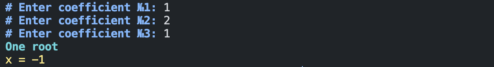
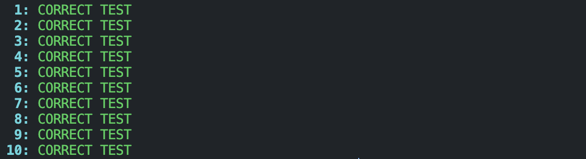
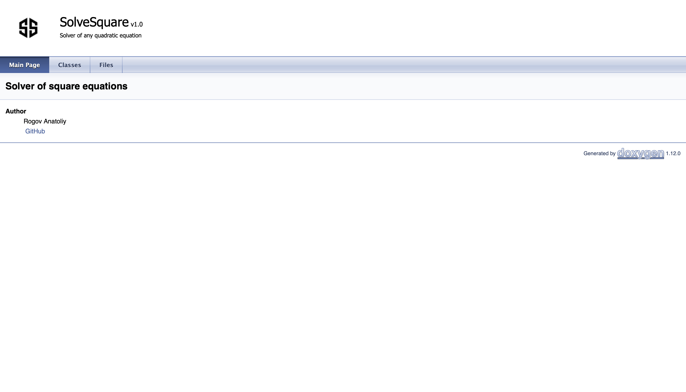
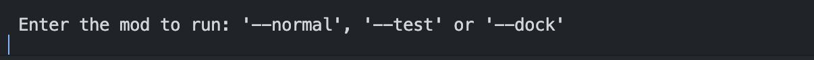
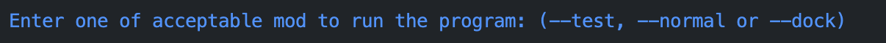

# SquareSolver

Программа решает любые квадратные уравнения.

## Оглавление

- [Описание проекта](#описание-проекта)
- [Начало работы с проектом](#начало-работы-с-проектом)
  - [Использованные инструменты](#использованные-инструменты)
  - [Установка](#установка)
  - [Запуск программы](#запуск-программы)
- [Помощь](#помощь)
- [Авторы](#авторы)
- [Благодарности](#благодарности)

## Описание проекта

После запуска программы пользователь выбирает что именно она должна запустить:

- ```
  --normal
  ```
  запускает решение квадратного уравнения с коэффициентами, введенными пользователем в командной строке.
  
- ```
  --test
  ```
  запускает процесс, позволяющий проверить функцию решения квадратного уравнения на внутренних тестах; unit-тестирование.
  
- ```
  --dock
  ```
  запускает создание doxygen-документации к проекту на основе Doxyfile и открывает её в виде html файла.
  

## Начало работы с проектом

### Использованные инструменты

- g++ компилятор, стандартные библиотеки языка C
- doxygen + graphviz для отображения документации.
- OS создания программы: macOS Sonoma 14.6
- IDE: Visual Studio Code

### Установка

```
git clone https://github.com/TolikRogov/SquareSolver
```

### Запуск программы

```
./run
```

Последующие необходимые для ввода команды появятся на экране после запуска программы



## Помощь

Для получения списка допустимых для ввода команд после запуска программы необходимо ввести:

```
--help
```



## Авторы

Рогов Анатолий

Почта: [tolik_rogov@bk.ru](mailto:tolik_rogov@bk.ru) <br>
Телеграм: [@rogovogor](https://t.me/rogovogor)

## Благодарности

Владимир Чурсин

[Телеграм](https://t.me/amlolaalready) <br>
[GitHub](https://github.com/Amlola)

Илья Дединский

[VK](https://vk.com/ded32_ru) <br>
[GitHub](https://github.com/ded32)
